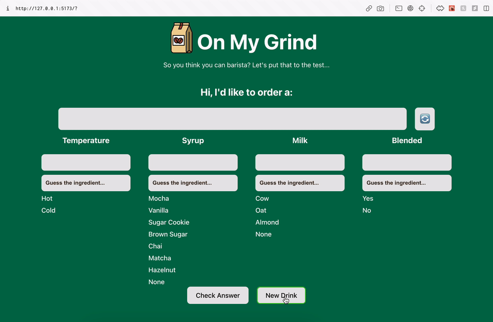

# Web Development Lab 3 - On My Grind

Submitted by: Noel Alfaro

Quiz yourself on Starbucks drinks. Can you be a barista? This is a web app built using React.js

Time spent: **3** hours spent in total

In the required features for this project, you will have a form with multiple choice inputs that can be typed in and selected and their values will populate the answer box above them. Then when submitted, the answer boxes will turn red if the answers placed there are incorrect and Green if the answers are correct.

This is a lab taken as part of Codepath's Intermediate Web Development Course

## Video Walkthrough

Here's a walkthrough of implemented required features:

GIF created with [Kap](https://getkap.co/) for macOS

## Notes

I had trouble using differenet notaion for passing down props at first, I'm used to just accepting (props) in a child component, I didn't know you could specify which props by name, it helps avoid having to do "props.example" in a child component.

## License

    Copyright 2023

    Licensed under the Apache License, Version 2.0 (the "License");
    you may not use this file except in compliance with the License.
    You may obtain a copy of the License at

        http://www.apache.org/licenses/LICENSE-2.0

    Unless required by applicable law or agreed to in writing, software
    distributed under the License is distributed on an "AS IS" BASIS,
    WITHOUT WARRANTIES OR CONDITIONS OF ANY KIND, either express or implied.
    See the License for the specific language governing permissions and
    limitations under the License.
